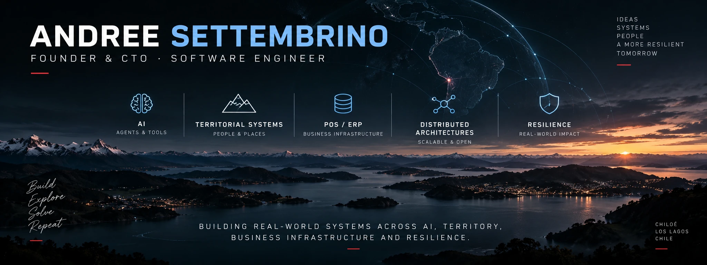

---

## Featured Systems

### [Distributed LLM Observatory](https://github.com/ArckomVanDrike/distributed-llm-observatory)

Open observatory for temporal, geographic and agentic variation across AI systems.

### [FlowField 3.0](/ArckomVanDrike/flowfield-open)

Field operations orchestration platform for guided, stateful and auditable workflows.

Built around deterministic workflow control, organizational governance, edge-first AI,
provider-agnostic inference and VLM-assisted field evidence.

### [Point X](https://github.com/ArckomVanDrike/point-x-open)

Navigation architecture focused on reaching meaningful targets beyond conventional maps.

### [Outy](https://github.com/ArckomVanDrike/outy-open)

Territorial multi-agent AI for local intelligence, services and real-world orchestration.

### [CashOut](https://github.com/ArckomVanDrike/cashout-open)

Multi-surface territorial ecosystem connecting people, community, services,
territorial knowledge and AI.

### [CashOut Negocios](https://github.com/ArckomVanDrike/cashout-negocios-open)

Modular ERP and POS platform for retail, restaurants and hospitality.

### [3AI Defence](https://github.com/ArckomVanDrike/3-ai-defence-open)

Distributed cyber-defence architecture based on separated roles, local AI,
controlled containment and trusted recovery.

---

## What I Build

- backend systems
- APIs
- POS and ERP infrastructure
- territorial and geospatial platforms
- AI and agent systems
- software testing and evaluation
- distributed and resilient architectures

- Field operations and workflow orchestration

---

## Current Focus

Building and evolving:

- CashOut
- CashOut Negocios
- Outy
- Distributed LLM Observatory
- FlowField 3.0
- Point X
- 3AI Defence

---

## Links

- GitHub: https://github.com/ArckomVanDrike
- LinkedIn: https://www.linkedin.com/in/andree-settembrino
- CashOut: https://cashout.cl
- CashOut Negocios — live product: https://cashoutnegocios.pythonanywhere.com/
